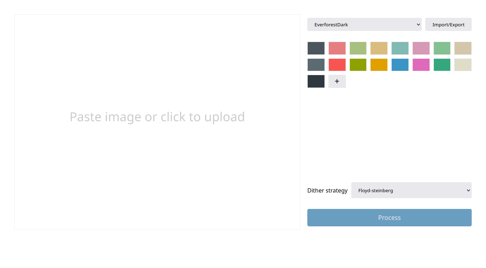

# Repalette

Repalette is an image colorizer written in C and Rust. It is available as both
a CLI utility and a web application.


## Features

- Recolor images using nearest neighbor search.
- Optional dithering with multisampling for smoother results.
- Palette extraction from any image
- SIMD accelerated palette search and dithering.
- Built-in palette presets bundled into the binary at compile time.
- Optimized encoding for small-palette PNG export.

**Web-version:**

- WASM-powered web application (mostly for mobile usage)
- Support for both text-based and color-picker-based palette editing
- Responsive layout and adaptive light/dark theme

## Usage

| input.jpg                  | output-no-dither.png                  | output-burkes.png                  |
| -------------------------- | ------------------------------------- | ---------------------------------- |
|  |  |  |

### CLI version

Examples:

```sh
# a built-in preset, with 2x multisampling
repalette apply input.jpg output.png -p nord -m 2x

# a manual palette (6-digit hex, no '#')
repalette apply input.jpg output-no-dither.png -c 000000,ff0000,ffffff --dither none
repalette apply input.jpg output-burkes.png -c 000000,ff0000,ffffff --dither burkes

# recolor using a palette extracted from the image itself (compression)
repalette apply input.jpg output-extracted.png -k 32

# recolor using a palette extracted from a different reference image
repalette apply input.jpg output-transfer.png --palette-from reference.jpg

# browse the presets
repalette palette list
repalette palette show gruvbox-dark

# extract an N-color palette from an image
repalette extract input.jpg -k 16

```

Run `repalette --help` to learn more 

### Web version

Host the website with any server or go to <https://ziap.github.io/repalette>.

The user interface:



## Building

**You need:**

- Both: Rust
- For native build: Any C compiler that supports C99.
- For WASM build: Clang, LLVM, and LLD.

Build the native version

```sh
cargo build --release
```

Build the WASM version

```sh
build.sh
```

## Benchmark

Recoloring to the 13-color `nord` palette. Times are wall-clock means
from [hyperfine](https://github.com/sharkdp/hyperfine); quality is
measured against the source (higher PSNR/SSIM = closer to the
original). Absolute numbers are hardware dependent, so read them as
relative.

**Dithering speed** on full 4K (3840x2160), repalette vs ImageMagick `-remap`:

| Tool        | Command                          |    Time |
| ----------- | -------------------------------- | ------: |
| repalette   | `-d none`                        |  198 ms |
| repalette   | `-d fs`                          |  297 ms |
| repalette   | `-d jjn`                         |  346 ms |
| ImageMagick | `-dither None -remap`            | 1050 ms |
| ImageMagick | `-dither FloydSteinberg -remap`  |  571 ms |
| ImageMagick | `-dither Riemersma -remap`       | 1256 ms |

NOTE: ImageMagick's `-dither FloydSteinberg -remap` uses approximate
nearest-neighbor search, hence it's faster than undithered remap.

Repalette uses exact search, but is still \~1.9x faster thanks to
SIMD acceleration.

**Multisample quality** on 1080p, Floyd–Steinberg:

| Method         | PSNR (dB) |  SSIM |
| -------------- | --------: | ----: |
| `-d none`      |     19.79 | 0.836 |
| `-d fs`        |     18.47 | 0.754 |
| `-d fs -m 2x`  |     20.02 | 0.857 |
| `-d fs -m 4x`  |     20.00 | 0.864 |

Error diffusion trades an artifact (color banding) for another
(grains). Both has imperfect quality, but dithering is worse because
it directly affect the image structural fidelity (SSIM).

Multisample mode combines colorization with image
resampling/filtering to smooth out the grains, while keeping the
band-free look. This recovers the quality and improves beyond the
no-dither baseline.

**Multisample performance** on 1080p, Floyd–Steinberg.

| Method                              |    Time | Memory |
| ----------------------------------- | ------: | -----: |
| repalette `-d none`                 |   57 ms |  18 MB |
| repalette `-d fs`                   |   82 ms |  18 MB |
| repalette `-d fs -m 2x`             |  206 ms |  18 MB |
| repalette `-d fs -m 4x`             |  695 ms |  18 MB |
| IM chain, 2x (Triangle)             |  663 ms | 193 MB |
| IM chain, 4x (Catrom, direct)       | 2430 ms | 595 MB |
| IM chain, 4x (Triangle, stacked 2x) | 2534 ms | 691 MB |

Multisample mode uses a fused algorithm with buffered streaming to
dramatically reduce memory usage, beating sequential processing
pipelines: \~3x faster and \~10-30x less memory.


## License

This project is licensed under the [AGPL-3.0 license](LICENSE).
