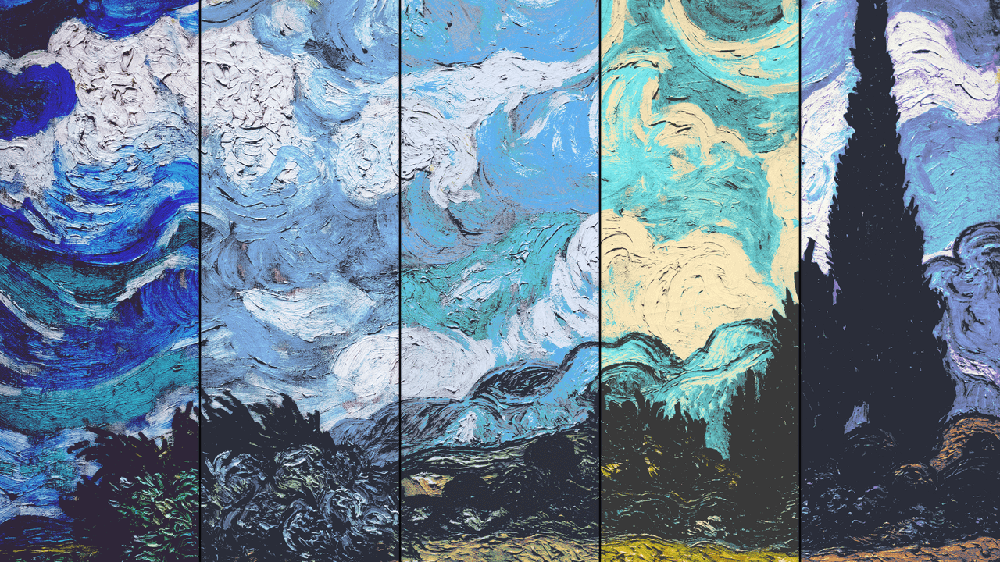
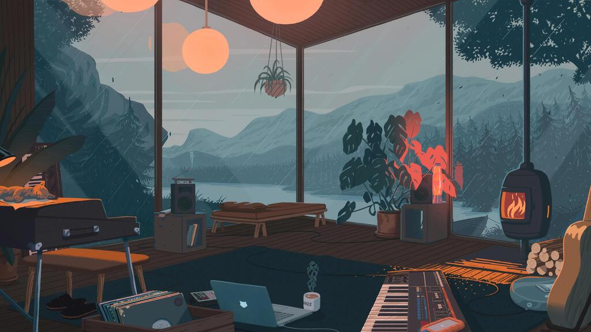
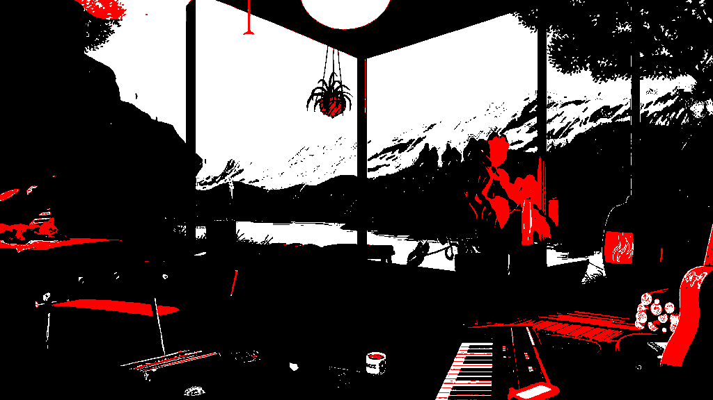
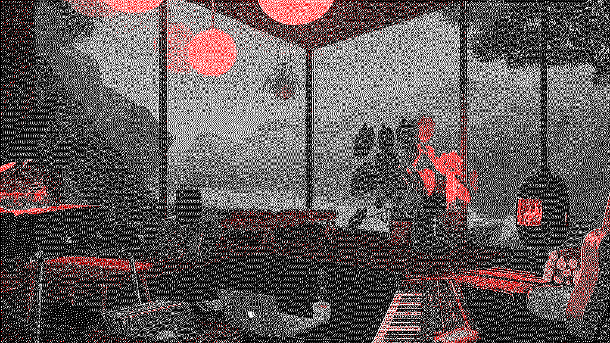

# Repalette

Repalette is an image colorizer written in C and Rust. It is available as both
a CLI utility and a web application.



## Features

- Recolor images using nearest neighbor search.
- Optional dithering for smoother results.
- SIMD accelerated palette search and dithering.
- Built-in palette presets from [Gogh](https://gogh-co.github.io/Gogh/),
  bundled into the binary at compile time.

**Web-version:**

- WASM-powered web application (mostly for mobile usage)
- Support for both text-based and color-picker-based palette editing
- Responsive layout and adaptive light/dark theme

## Benchmark

(TBA)

To run the benchmark yourself:

- Install [hyperfine](https://github.com/sharkdp/hyperfine)
- Build the CLI version
- Put an image with the name `test.jpg` in the same directory as `benchmark.sh`
- Run `./benchmark.sh`

## Building

**You need:**

- Both: Rust
- For native build: Any C compiler that supports C99.
- For WASM build: Clang, LLVM, and LLD.

Build the native version

```
cargo build --release
```

Build the WASM version

```
cargo build --release --features wasm
```

## Usage

### CLI version

Examples:

```
# a built-in preset
repalette apply input.jpg output.png -p nord

# a manual palette (6-digit hex, no '#')
repalette apply input.jpg output-no-dither.png -c 000000,ff0000,ffffff --dither none
repalette apply input.jpg output-burkes.png -c 000000,ff0000,ffffff --dither burkes

# browse the presets
repalette palette list
repalette palette show gruvbox-dark
```

| input.jpg          | output-no-dither.png          | output-burkes.png          |
| ------------------ | ----------------------------- | -------------------------- |
|  |  |  |

Run `repalette --help` to learn more 

### Web version

Host the website with any server or go to <https://ziap.github.io/repalette>.

The user interface:


## License

This project is licensed under the [AGPL-3.0 license](LICENSE).
